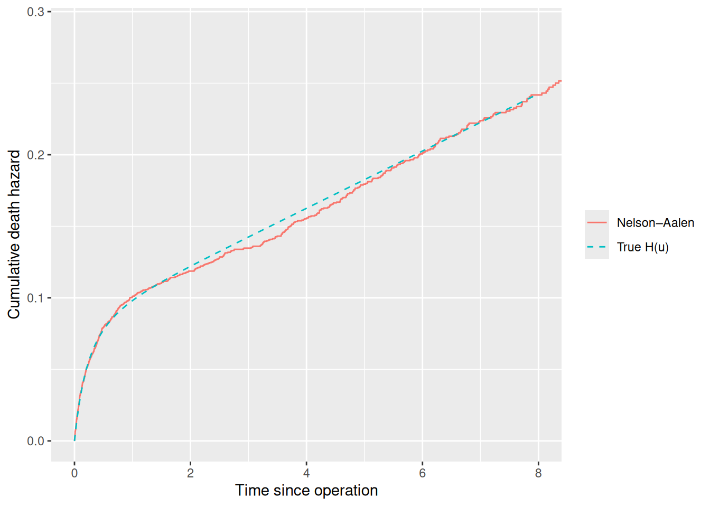
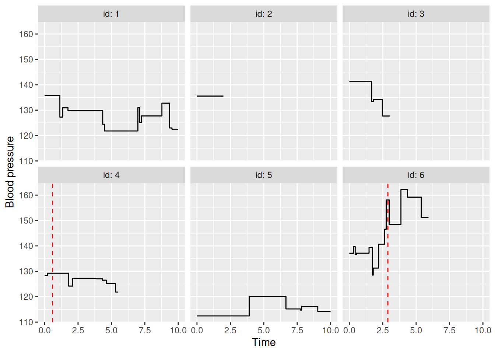

# Event Times and Time-Varying Markers

``` r

library(simevent)
library(survival)
library(ggplot2)
library(data.table)
```

This vignette shows two ways of making hazards depend on an individual’s
history in
[`sim_model()`](https://github.com/BjarkeHautop/simevent/reference/sim_model.md):

1.  **Event times**, `T_<proc>.<k>`: effects that depend on *when* an
    event happened.
2.  **Markers**,
    [`sim_marker()`](https://github.com/BjarkeHautop/simevent/reference/sim_marker.md):
    covariates that are re-measured over time, e.g. a lab value drawn at
    each visit.

## Event Times: `T_<proc>.<k>`

Inside a
[`sim_effect()`](https://github.com/BjarkeHautop/simevent/reference/sim_effect.md)
expression, `T_<proc>.<k>` is the time of process `proc`’s `k`-th event,
and `0` if it hasn’t happened yet. Combined with the current time `t`,
this gives effects on time since an event: `t - T_operation.1` is the
time since the first operation.

Since `T_<proc>.<k>` is `0` before the event, `t - T_operation.1` is
just `t` for someone not yet operated. Multiplying by the event count,
as in `operation * f(t - T_operation.1)`, can be use to have the effect
off until the event has happened.

### Example: Post-Operative Mortality

Patients may undergo an operation, which raises the death hazard sharply
right afterwards. The extra risk fades as the patient recovers:

\lambda\_{\text{death}}(t) = \lambda_0(t) \exp\left( 3 \cdot
\text{operation}(t) \cdot e^{-2(t-T\_{\text{operation},1})} \right).

``` r

operation_model <- sim_model(
  censoring = sim_process("censoring", eta = 0.05, nu = 1),
  operation = sim_process("transient", eta = 0.2, nu = 1, limit = 1),
  death = sim_process("terminal", eta = 0.02, nu = 1),
  effects = list(
    sim_effect("operation * exp(-2 * (t - T_operation.1))", "death", coef = 3)
  )
)

operation_data <- sim_events(
  operation_model,
  n = 5000,
  max_cens = 10,
  seed = 1
)
head(operation_data)
#> Key: <id>
#>       id       time     event operation
#>    <int>      <num>    <fctr>     <num>
#> 1:     1  4.9115104 censoring         0
#> 2:     2  3.6612164 operation         1
#> 3:     2 10.0000000  max_cens         1
#> 4:     3  2.0634278 operation         1
#> 5:     3  6.4647265     death         1
#> 6:     4  0.3566003 operation         1
```

Here all baseline hazards are constant (\nu = 1), so \lambda_0(t) =
0.02. After the operation, measured in time since the operation, u = t -
T\_{\text{operation},1}, the death hazard is therefore

h(u) = 0.02 \exp\left( 3 e^{-2u} \right),

with cumulative hazard (substituting w = 3 e^{-2v})

H(u) = \int_0^u h(v) \\ dv = 0.01 \left\[ \operatorname{Ei}(3) -
\operatorname{Ei}\left( 3 e^{-2u} \right) \right\],

where \operatorname{Ei} is the exponential integral. The hazard starts
at 0.02 e^3 \approx 0.40, 20 times the baseline, and falls back to 0.02
within a couple of time units.

To check the simulation, follow each operated patient from their
operation until death or censoring, and compare the Nelson–Aalen
estimate of the cumulative death hazard with H(u). Censoring and the end
of follow-up don’t depend on time since the operation, so the estimate
is unbiased.

``` r

operation_time <- operation_data[event == "operation", .(id, T_op = time)]
post_op <- merge(
  operation_data[, .SD[.N], by = id],
  operation_time,
  by = "id"
)
post_op[, u := time - T_op]

fit <- survfit(Surv(u, event == "death") ~ 1, data = post_op)

H <- function(u) {
  vapply(
    u,
    function(x) integrate(function(v) 0.02 * exp(3 * exp(-2 * v)), 0, x)$value,
    numeric(1)
  )
}
u_grid <- seq(0, 8, length.out = 200)

ggplot() +
  geom_step(aes(fit$time, fit$cumhaz, colour = "Nelson–Aalen")) +
  geom_line(aes(u_grid, H(u_grid), colour = "True H(u)"), linetype = "dashed") +
  coord_cartesian(xlim = c(0, 8)) +
  labs(
    x = "Time since operation",
    y = "Cumulative death hazard",
    colour = NULL
  )
```



Other shapes follow the same pattern. The `from` expression times `coef`
is added to the log-hazard, for example:

| `from` | Effect on the log-hazard |
|----|----|
| `operation * (t - T_operation.1)` | Grows linearly with time since the operation |
| `operation * (t - T_operation.1 < 1)` | Constant for one time unit after, then gone |
| `(relapse >= 2) * (t - T_relapse.2)` | Grows linearly with time since the second relapse |

The index `k` can’t exceed the process’s `limit`, since that event could
never happen;
[`sim_model()`](https://github.com/BjarkeHautop/simevent/reference/sim_model.md)
gives an error instead.

## Time-Varying Markers: `sim_marker()`

A
[`sim_covariate()`](https://github.com/BjarkeHautop/simevent/reference/sim_covariate.md)
is drawn once at baseline and never changes. A
[`sim_marker()`](https://github.com/BjarkeHautop/simevent/reference/sim_marker.md)
is drawn at baseline and then *redrawn* each time one of its `update`
processes fires, staying constant in between. It takes:

- `init`: a function of `N` (and earlier covariates) giving the baseline
  values, as for
  [`sim_covariate()`](https://github.com/BjarkeHautop/simevent/reference/sim_covariate.md).
- `update`: the transient processes whose events redraw the marker.
- `draw`: a function giving the new values. Its arguments are matched by
  name against `N`, the event time `t`, any covariate or marker
  (including the marker’s own current value), and any process’s event
  count so far.

The marker can be used in
[`sim_effect()`](https://github.com/BjarkeHautop/simevent/reference/sim_effect.md)
like any other covariate, and the hazards always use its current value.

### Example: Blood Pressure and Stroke

Patients have blood pressure measured at visits. High blood pressure
makes treatment initiation more likely, treatment lowers subsequent
blood pressure, and both blood pressure and treatment affect the stroke
hazard. Blood pressure is therefore a time-varying confounder of the
effect of treatment on stroke.

Let’s define such a setup, where each new measurement depends on the
previous one and on treatment:

\text{bp}\_{\text{new}} \sim N\left( 130 + 0.8
(\text{bp}\_{\text{prev}} - 130) - 2 \cdot \text{treatment}, \\ 6^2
\right).

Untreated, blood pressure fluctuates around 130. Treatment lowers each
new measurement by 2, and since each measurement carries over 0.8 of the
previous one’s deviation, the effect accumulates to 2 / (1 - 0.8) = 10:
the treated settle around 120.

``` r

bp_model <- sim_model(
  age = sim_covariate(function(N) rnorm(N, mean = 60, sd = 10)),
  visit = sim_process("transient", eta = 1, nu = 1),
  bp = sim_marker(
    init = function(N, age) rnorm(N, 130 + 0.5 * (age - 60), 12),
    update = "visit",
    draw = function(N, bp, treatment) {
      rnorm(N, 130 + 0.8 * (bp - 130) - 2 * treatment, 6)
    }
  ),
  # Keep the baseline value too, as sim_derived() sees the marker's init:
  bp0 = sim_derived(function(bp) bp),
  treatment = sim_process("transient", eta = 0.05, nu = 1, limit = 1),
  censoring = sim_process("censoring", eta = 0.05, nu = 1),
  stroke = sim_process("terminal", eta = 0.02, nu = 1.2),
  effects = list(
    sim_effect("bp - 130", "treatment", coef = 0.08),
    sim_effect("bp - 130", "stroke", coef = 0.04),
    sim_effect("treatment", "stroke", coef = -0.5)
  )
)
summary(bp_model)
#> <sim_model> covariates
#>  name     kind
#>   age baseline
#>    bp   marker
#>   bp0  derived
#> 
#> <sim_model> processes
#>       name      type baseline  eta  nu limit
#>      visit transient  weibull 1.00 1.0   Inf
#>  treatment transient  weibull 0.05 1.0     1
#>  censoring censoring  weibull 0.05 1.0   Inf
#>     stroke  terminal  weibull 0.02 1.2   Inf
#> 
#> <sim_model> effects
#>       from        to  coef
#>   bp - 130 treatment  0.08
#>   bp - 130    stroke  0.04
#>  treatment    stroke -0.50

bp_data <- sim_events(bp_model, n = 3000, max_cens = 10, seed = 1)
head(bp_data, 8)
#> Key: <id>
#>       id     time  event      age       bp      bp0 visit treatment
#>    <int>    <num> <fctr>    <num>    <num>    <num> <num>     <num>
#> 1:     1 1.140060  visit 53.73546 127.2870 135.7371     1         0
#> 2:     1 1.353592  visit 53.73546 130.9426 135.7371     2         0
#> 3:     1 1.746443  visit 53.73546 129.8539 135.7371     3         0
#> 4:     1 4.345083  visit 53.73546 124.4467 135.7371     4         0
#> 5:     1 4.478843  visit 53.73546 121.8104 135.7371     5         0
#> 6:     1 6.980231  visit 53.73546 131.0238 135.7371     6         0
#> 7:     1 7.116576  visit 53.73546 125.1255 135.7371     7         0
#> 8:     1 7.236297  visit 53.73546 127.7269 135.7371     8         0
```

Each row holds the marker’s value *after* that row’s event, so `bp`
changes on `visit` rows and is carried forward otherwise.

Blood pressure trajectories for a few patients, with the treatment start
marked:

``` r

ids <- 1:6
baseline <- bp_data[id %in% ids, .(time = 0, bp = bp0[1]), by = id]
trajectories <- rbind(baseline, bp_data[id %in% ids, .(id, time, bp)])
treated <- bp_data[id %in% ids & event == "treatment"]

ggplot(trajectories, aes(time, bp)) +
  geom_step() +
  geom_vline(
    aes(xintercept = time),
    data = treated,
    linetype = "dashed",
    colour = "red"
  ) +
  facet_wrap(~id, labeller = label_both) +
  labs(x = "Time", y = "Blood pressure")
```



### Recovering the Effects

To check the simulation works correctly we fit a Cox model for stroke.
The blood pressure in force during a row’s interval is the previous
row’s value (or the baseline value, for the first row):

``` r

bp_data[, `:=`(
  tstart = shift(time, fill = 0),
  bp_now = shift(bp, fill = bp0[1]),
  treated_now = shift(treatment, fill = 0)
), by = id]

coxph(
  Surv(tstart, time, event == "stroke") ~ I(bp_now - 130) + treated_now,
  data = bp_data
)
#> Call:
#> coxph(formula = Surv(tstart, time, event == "stroke") ~ I(bp_now - 
#>     130) + treated_now, data = bp_data)
#> 
#>                      coef exp(coef)  se(coef)      z        p
#> I(bp_now - 130)  0.034805  1.035418  0.003734  9.321  < 2e-16
#> treated_now     -0.460699  0.630843  0.102513 -4.494 6.99e-06
#> 
#> Likelihood ratio test=100.9  on 2 df, p=< 2.2e-16
#> n= 24636, number of events= 638
```

The estimates are close to the simulated effects of `0.04` and `-0.5`.

The marker’s own `draw` can be checked the same way. On each `visit`
row, `bp` is the new measurement and `bp_now` the previous one, so
regressing one on the other and treatment should give roughly `0.8`,
`-2`, and a residual standard deviation of `6`:

``` r

bp_fit <- lm(
  I(bp - 130) ~ 0 + I(bp_now - 130) + treated_now,
  data = bp_data[event == "visit"]
)
coef(bp_fit)
#> I(bp_now - 130)     treated_now 
#>       0.8015799      -2.0838156
sigma(bp_fit)
#> [1] 6.010538
```
