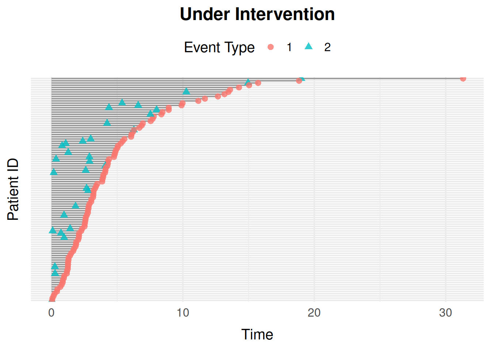

# Migrating to sim_event_graph()

``` r

library(simevent)
library(survival)

compare_graph <- function(wrapper_data, graph_data) {
  wrapper_data <- as.data.frame(wrapper_data)
  graph_data <- as.data.frame(graph_data)
  names(graph_data)[match(c("id", "time", "delta"), names(graph_data))] <-
    c("ID", "Time", "Delta")
  isTRUE(all.equal(
    wrapper_data,
    graph_data[names(wrapper_data)],
    tolerance = 1e-6
  ))
}
```

`compare_graph()` checks that a
[`sim_event_graph()`](https://github.com/miclukacova/simevent/reference/sim_event_graph.md)
reproduction draws the exact same random numbers, in the same order, as
the wrapper it’s reproducing. That only holds below for
[`simSurvData()`](https://github.com/miclukacova/simevent/reference/simSurvData.md)/[`simCRdata()`](https://github.com/miclukacova/simevent/reference/simCRdata.md).

[`simDisease()`](https://github.com/miclukacova/simevent/reference/simDisease.md)/[`simTreatment()`](https://github.com/miclukacova/simevent/reference/simTreatment.md)
each have a `"transient"` process, so some individuals finish before
others;
[`sim_event_graph()`](https://github.com/miclukacova/simevent/reference/sim_event_graph.md)
draws random numbers only for whoever’s still being simulated, while the
wrapper always draws for everyone (including those already finished) and
discards the unused draws.

## Introduction

This introduces the new API with
[`sim_event_graph()`](https://github.com/miclukacova/simevent/reference/sim_event_graph.md),
which is (probably?) a better interface.

## The `sim_graph()` Interface

A
[`sim_graph()`](https://github.com/miclukacova/simevent/reference/sim_graph.md)
call has three kinds of possible inputs:

- [`sim_covariate()`](https://github.com/miclukacova/simevent/reference/sim_covariate.md):
  a baseline covariate generator. Takes `N` and, optionally, any other
  covariate defined earlier in the same call (matched by argument name).
- [`sim_process()`](https://github.com/miclukacova/simevent/reference/sim_process.md):
  a `"censoring"`, `"terminal"`, or `"transient"` (fires at most `limit`
  times, default `Inf`) process, with Weibull `eta`/`nu` parameters.
- [`sim_effect()`](https://github.com/miclukacova/simevent/reference/sim_effect.md):
  a `from -> to` edge with a Cox-type `coef`, where `from` is a
  covariate or process name and `to` is a process name.

``` r

graph <- sim_graph(
  L0 = sim_covariate(function(N) rbinom(N, 1, 0.4)),
  censoring = sim_process("censoring", eta = 0.1, nu = 1.1),
  death = sim_process("terminal", eta = 0.1, nu = 1.1),
  effects = list(sim_effect("L0", "death", coef = 1.5))
)
graph
#> <sim_graph>
#>   1 covariate(s): L0
#>   2 process(es): censoring, death
#>   1 effect(s)

data <- sim_event_graph(graph, n = 100)
head(data)
#> Key: <id>
#>       id      time delta    L0
#>    <int>     <num> <int> <int>
#> 1:     1 1.3269158     0     0
#> 2:     2 0.1127537     1     1
#> 3:     3 2.3286819     0     0
#> 4:     4 1.8986339     1     0
#> 5:     5 4.2103320     1     1
#> 6:     6 0.9263833     0     0
```

[`sim_event_graph()`](https://github.com/miclukacova/simevent/reference/sim_event_graph.md)’s
`intervene` argument replaces
[`sim.generic()`](https://github.com/miclukacova/simevent/reference/sim.generic.md)’s
`alpha.intervention`/`baseline.intervention` pair with a single named
list: give a process name to scale its `eta`, or a covariate name to fix
it to a constant.

``` r

data_intervened <- sim_event_graph(
  graph,
  n = 100,
  intervene = list(death = 0.2, L0 = 1)
)
head(data_intervened)
#> Key: <id>
#>       id     time delta    L0
#>    <int>    <num> <int> <num>
#> 1:     1 1.194452     1     1
#> 2:     2 1.568504     1     1
#> 3:     3 6.463053     0     1
#> 4:     4 1.316111     1     1
#> 5:     5 5.827507     0     1
#> 6:     6 1.322803     1     1
```

## Reproducing the Preset Wrappers

### `simSurvData()`

[`simSurvData()`](https://github.com/miclukacova/simevent/reference/simSurvData.md)’s
default (`beta = NULL`, i.e. no covariate effects) is two terminal
processes, censoring and death, both with `eta = 0.1`, `nu = 1.1`:

``` r

set.seed(1405)
wrapper_data <- simSurvData(200)

set.seed(1405)
graph <- sim_graph(
  L0 = sim_covariate(function(N) runif(N)),
  A0 = sim_covariate(function(N, L0) rbinom(N, 1, 0.5)),
  censoring = sim_process("censoring", eta = 0.1, nu = 1.1),
  death = sim_process("terminal", eta = 0.1, nu = 1.1)
)
graph_data <- sim_event_graph(graph, n = 200)

compare_graph(wrapper_data, graph_data)
#> [1] TRUE
```

### `simCRdata()`

[`simCRdata()`](https://github.com/miclukacova/simevent/reference/simCRdata.md)
adds a third terminal process (a second competing cause):

``` r

set.seed(1405)
beta <- matrix(c(0.5, -1, -0.5, 0.5, 0, 0.5), ncol = 3, nrow = 2)
wrapper_data <- simCRdata(N = 200, beta = beta)

set.seed(1405)
graph <- sim_graph(
  L0 = sim_covariate(function(N) runif(N)),
  A0 = sim_covariate(function(N, L0) rbinom(N, 1, 0.5)),
  censoring = sim_process("censoring", eta = 0.1, nu = 1.1),
  cause1 = sim_process("terminal", eta = 0.1, nu = 1.1),
  cause2 = sim_process("terminal", eta = 0.1, nu = 1.1),
  effects = list(
    sim_effect("L0", "censoring", 0.5),
    sim_effect("A0", "censoring", -1),
    sim_effect("L0", "cause1", -0.5),
    sim_effect("A0", "cause1", 0.5),
    sim_effect("A0", "cause2", 0.5)
  )
)
graph_data <- sim_event_graph(graph, n = 200)

compare_graph(wrapper_data, graph_data)
#> [1] TRUE
```

### `simDisease()`

[`simDisease()`](https://github.com/miclukacova/simevent/reference/simDisease.md)
has a censoring process, a terminal death process, and a covariate
process `L` that can happen at most once and can itself affect death; a
`"transient"` process with `limit = 1`. Since `L` can fire, the
simulation loop can run more than once per individual, so
[`sim_event_graph()`](https://github.com/miclukacova/simevent/reference/sim_event_graph.md)’s
random draws no longer line up one-to-one with
[`simDisease()`](https://github.com/miclukacova/simevent/reference/simDisease.md)’s
(see the note on `compare_graph()` above); event-type proportions are
compared instead:

``` r

set.seed(1405)
wrapper_data <- simDisease(
  N = 5000,
  cens = 1,
  eta = c(0.1, 0.3, 0.1),
  nu = c(1.1, 1.3, 1.1),
  beta_L0_L = 1,
  beta_A0_L = -1.1,
  beta_L_D = 1,
  beta_L0_D = 0
)

graph <- sim_graph(
  L0 = sim_covariate(function(N) runif(N)),
  A0 = sim_covariate(function(N, L0) rbinom(N, 1, 0.5)),
  censoring = sim_process("censoring", eta = 0.1, nu = 1.1),
  death = sim_process("terminal", eta = 0.3, nu = 1.3),
  L = sim_process("transient", eta = 0.1, nu = 1.1, limit = 1),
  effects = list(
    sim_effect("L0", "L", 1),
    sim_effect("A0", "L", -1.1),
    sim_effect("L", "death", 1)
  )
)
graph_data <- sim_event_graph(graph, n = 5000)

rbind(
  simDisease = prop.table(table(wrapper_data$Delta)),
  sim_graph = prop.table(table(graph_data$delta))
)
#>                    0         1         2
#> simDisease 0.1687941 0.6709775 0.1602284
#> sim_graph  0.1593545 0.6811229 0.1595226
```

### `simTreatment()`

[`simTreatment()`](https://github.com/miclukacova/simevent/reference/simTreatment.md)
(with `op = 1`, the default) adds a second `"transient"` process,
treatment (`A`), which can itself affect and be affected by the
covariate process `L`.
[`simTreatment()`](https://github.com/miclukacova/simevent/reference/simTreatment.md)
doesn’t declare its own `A0`, so its reproduction doesn’t need one
either –
[`sim_graph()`](https://github.com/miclukacova/simevent/reference/sim_graph.md)
forces no default covariates:

``` r

set.seed(1405)
wrapper_data <- simTreatment(
  N = 5000,
  beta_L_A = 1,
  beta_L_D = 1,
  beta_A_D = -1,
  beta_A_L = -0.5,
  beta_L0_A = 1,
  eta = rep(0.1, 4),
  nu = rep(1.1, 4),
  cens = 1,
  op = 1
)

graph <- sim_graph(
  L0 = sim_covariate(function(N) runif(N)),
  censoring = sim_process("censoring", eta = 0.1, nu = 1.1),
  death = sim_process("terminal", eta = 0.1, nu = 1.1),
  A = sim_process("transient", eta = 0.1, nu = 1.1, limit = 1),
  L = sim_process("transient", eta = 0.1, nu = 1.1, limit = 1),
  effects = list(
    sim_effect("L0", "death", 1),
    sim_effect("L0", "A", 1),
    sim_effect("L0", "L", 1),
    sim_effect("A", "death", -1),
    sim_effect("A", "L", -0.5),
    sim_effect("L", "death", 1),
    sim_effect("L", "A", 1)
  )
)
graph_data <- sim_event_graph(graph, n = 5000)

rbind(
  simTreatment = prop.table(table(wrapper_data$Delta)),
  sim_graph = prop.table(table(graph_data$delta))
)
#>                      0         1         2         3
#> simTreatment 0.2233639 0.3350458 0.2285012 0.2130891
#> sim_graph    0.2180713 0.3445482 0.2259480 0.2114324
```

### `simStatinData()`

[`simStatinData()`](https://github.com/miclukacova/simevent/reference/simStatinData.md)
mainly demonstrates non-default baseline covariate generators.
[`sim_covariate()`](https://github.com/miclukacova/simevent/reference/sim_covariate.md)
reproduces this directly, with no forced covariate names to work around:

``` r

set.seed(1405)
graph <- sim_graph(
  L0 = sim_covariate(function(N) rbinom(N, 1, 0.4)),
  A0 = sim_covariate(function(N, L0) pmin(rexp(N, 0.3) + 70, 100)),
  censoring = sim_process("censoring", eta = 0.025, nu = 1.1),
  death = sim_process("terminal", eta = 0.025, nu = 1.1)
)
graph_data <- sim_event_graph(graph, n = 200)
summary(graph_data$A0)
#>    Min. 1st Qu.  Median    Mean 3rd Qu.    Max. 
#>   70.00   70.82   71.96   73.14   74.18   85.01
```

## Estimating Intervention Effects

[`alphaSim()`](https://github.com/miclukacova/simevent/reference/alphaSim.md)
and
[`intEffectAlpha()`](https://github.com/miclukacova/simevent/reference/intEffectAlpha.md)
simulate one of the preset settings with the shape parameter `eta` of
one process multiplied by `alpha`, and summarise the result as the
proportion of individuals experiencing death and the intervened process
by time \tau (or the years lost to them before \tau). With the graph API
this splits into two general steps, which work for any process in any
graph:

1.  Simulate under the intervention with
    [`sim_event_graph()`](https://github.com/miclukacova/simevent/reference/sim_event_graph.md)’s
    `intervene` argument: `intervene = list(<process> = alpha)`
    multiplies that process’s `eta` by `alpha`.
2.  Summarise with
    [`event_risk()`](https://github.com/miclukacova/simevent/reference/event_risk.md):
    the risk P(T \le \tau) of each process’s first event, or
    (`type = "time_lost"`) the expected time lost to it before \tau,
    E\[\tau - \min(T, \tau)\].

Take
[`alphaSim()`](https://github.com/miclukacova/simevent/reference/alphaSim.md)’s
`"Disease"` setting with `alpha = 0.5`, which halves the hazard of the
disease process `L`:

``` r

set.seed(1405)
alphaSim(
  N = 5000,
  eta = rep(0.1, 3),
  nu = rep(1.1, 3),
  alpha = 0.5,
  tau = 5,
  setting = "Disease"
)
#> $effectDeath
#> [1] 0.6977671
#> 
#> $effectSetting
#> [1] 0.2531898
```

The same model as a graph:

``` r

disease_graph <- sim_graph(
  L0 = sim_covariate(function(N) runif(N)),
  A0 = sim_covariate(function(N, L0) rbinom(N, 1, 0.5)),
  censoring = sim_process("censoring", eta = 0.1, nu = 1.1),
  death = sim_process("terminal", eta = 0.1, nu = 1.1),
  L = sim_process("transient", eta = 0.1, nu = 1.1, limit = 1),
  effects = list(
    sim_effect("L0", "death", 1),
    sim_effect("L0", "L", 1),
    sim_effect("L", "death", 1)
  )
)
```

[`alphaSim()`](https://github.com/miclukacova/simevent/reference/alphaSim.md)
switches censoring off by default (`cens = 0`). Simulating both with and
without the intervention gives the effect directly:

``` r

set.seed(1405)
observed <- sim_event_graph(disease_graph, n = 5000, cens = 0)
intervened <- sim_event_graph(
  disease_graph,
  n = 5000,
  cens = 0,
  intervene = list(L = 0.5)
)

risk_observed <- event_risk(observed, disease_graph, c("death", "L"), tau = 5)
risk_intervened <- event_risk(
  intervened,
  disease_graph,
  c("death", "L"),
  tau = 5
)
cbind(
  risk_observed[, "process"],
  observed = risk_observed$risk,
  intervened = risk_intervened$risk
)
#>    process observed intervened
#>     <char>    <num>      <num>
#> 1:   death   0.7536     0.7048
#> 2:       L   0.4240     0.2522
```

Halving the disease hazard lowers the risk of disease, and, since
disease raises the death hazard (`sim_effect("L", "death", 1)`), the
risk of death too.

[`alphaSim()`](https://github.com/miclukacova/simevent/reference/alphaSim.md)/[`intEffectAlpha()`](https://github.com/miclukacova/simevent/reference/intEffectAlpha.md)’s
`years_lost = TRUE` corresponds to `type = "time_lost"`, and their `a0`
argument (summarise only individuals with `A0 == a0`) to `by = "A0"`,
which summarises every group at once:

``` r

event_risk(
  intervened,
  disease_graph,
  c("death", "L"),
  tau = 5,
  type = "time_lost",
  by = "A0"
)
#>       A0 process time_lost
#>    <int>  <char>     <num>
#> 1:     0   death 1.9576333
#> 2:     1   death 1.9396741
#> 3:     0       L 0.7580466
#> 4:     1       L 0.7724950
```

`by` conditions on the observed value of `A0`. For a `do()`-style
contrast, where everyone’s `A0` is set to a value, fix it with
`intervene` instead, e.g. `intervene = list(L = 0.5, A0 = 1)`.

Finally,
[`intEffectAlpha()`](https://github.com/miclukacova/simevent/reference/intEffectAlpha.md)’s
`plot = TRUE` is
[`plot_event_data()`](https://github.com/miclukacova/simevent/reference/plot_event_data.md)
on the intervened data:

``` r

plot_event_data(
  intervened[intervened$id <= 100, ],
  title = "Under Intervention"
)
```



## Building a `sim_graph()` from Fitted Cox Models

[`sim_graph_from_fits()`](https://github.com/miclukacova/simevent/reference/sim_graph_from_fits.md)
is the graph-native replacement for
[`sim.from.data()`](https://github.com/miclukacova/simevent/reference/sim.from.data.md):
instead of user-specified effects, it builds a
[`sim_graph()`](https://github.com/miclukacova/simevent/reference/sim_graph.md)
from a set of fitted
[`coxph()`](https://rdrr.io/pkg/survival/man/coxph.html) models (one per
process) and the data they were fit to, so simulated data mimics an
observed dataset’s distribution.

Unlike
[`sim.from.data()`](https://github.com/miclukacova/simevent/reference/sim.from.data.md),
which requires building a `sim.parameters` list, including a
`baseline.summary` computed by hand from
[`mean()`](https://rdrr.io/r/base/mean.html)/
[`sd()`](https://rdrr.io/r/stats/sd.html)/[`min()`](https://rdrr.io/r/base/Extremes.html)/[`max()`](https://rdrr.io/r/base/Extremes.html),
[`sim_graph_from_fits()`](https://github.com/miclukacova/simevent/reference/sim_graph_from_fits.md)
reads baseline covariate distributions straight from the data itself.

``` r

# Some "observed" data, from a 3-cause competing-risks sim_graph():
set.seed(1405)
observed_graph <- sim_graph(
  L0 = sim_covariate(function(N) runif(N)),
  A0 = sim_covariate(function(N, L0) rbinom(N, 1, 0.5)),
  censoring = sim_process("censoring", eta = 0.1, nu = 1.1),
  cause1 = sim_process("terminal", eta = 0.1, nu = 1.1),
  cause2 = sim_process("terminal", eta = 0.1, nu = 1.1),
  effects = list(
    sim_effect("L0", "censoring", 0.5),
    sim_effect("A0", "censoring", -1),
    sim_effect("L0", "cause1", -0.5),
    sim_effect("A0", "cause1", 0.5),
    sim_effect("A0", "cause2", 0.5)
  )
)
observed_data <- sim_event_graph(observed_graph, n = 1000)

# Refit each process from that "observed" data, then rebuild a sim_graph()
# from the fits, as if observed_data came from an outside source and
# observed_graph were unknown:
fits <- list(
  censoring = coxph(Surv(time, delta == 0) ~ L0 + A0, data = observed_data),
  cause1 = coxph(Surv(time, delta == 1) ~ L0 + A0, data = observed_data),
  cause2 = coxph(Surv(time, delta == 2) ~ L0 + A0, data = observed_data)
)
types <- c(censoring = "censoring", cause1 = "terminal", cause2 = "terminal")

graph <- sim_graph_from_fits(fits, observed_data, types)
graph
#> <sim_graph>
#>   2 covariate(s): L0, A0
#>   3 process(es): censoring, cause1, cause2
#>   6 effect(s)
```

Each process’s Weibull `eta`/`nu` is approximated from its
[`coxph()`](https://rdrr.io/pkg/survival/man/coxph.html) fit’s baseline
cumulative hazard, by regressing log(cumulative hazard) on log(time) (a
Weibull hazard is linear on that scale).

``` r

new_data <- sim_event_graph(graph, n = 1000)
head(new_data)
#> Key: <id>
#>       id     time delta        L0    A0
#>    <int>    <num> <int>     <num> <int>
#> 1:     1 4.549795     0 1.0532139     1
#> 2:     2 3.550653     0 0.5385115     0
#> 3:     3 1.797275     1 0.8235271     1
#> 4:     4 1.095931     2 0.7444320     0
#> 5:     5 8.083563     0 0.4030154     0
#> 6:     6 1.474290     0 0.4556481     1

# Event-type distribution should be comparable between the observed and
# newly simulated data:
rbind(
  observed = prop.table(table(observed_data$delta)),
  simulated = prop.table(table(new_data$delta))
)
#>               0     1     2
#> observed  0.294 0.316 0.390
#> simulated 0.280 0.327 0.393
```

### Categorical Baseline Covariates

A categorical baseline covariate must be a factor column in `data`,
referenced directly in the
[`coxph()`](https://rdrr.io/pkg/survival/man/coxph.html) formula (not
wrapped in [`factor()`](https://rdrr.io/r/base/factor.html) there).
[`sim_graph_from_fits()`](https://github.com/miclukacova/simevent/reference/sim_graph_from_fits.md)
regenerates it as a categorical draw from its observed level
proportions, plus one
[`sim_derived()`](https://github.com/miclukacova/simevent/reference/sim_derived.md)
dummy per non-reference level, named to match
[`coxph()`](https://rdrr.io/pkg/survival/man/coxph.html)’s own
coefficient names (`"<variable><level>"`). The graph-native replacement
for
[`sim.from.data()`](https://github.com/miclukacova/simevent/reference/sim.from.data.md)’s
`"(region==2)"`-style expression matching.

``` r

observed_data$region <- factor(sample(
  c("a", "b", "c"),
  nrow(observed_data),
  replace = TRUE,
  prob = c(0.5, 0.3, 0.2)
))

fits_region <- list(
  censoring = coxph(
    Surv(time, delta == 0) ~ L0 + region,
    data = observed_data
  ),
  cause1 = coxph(Surv(time, delta == 1) ~ L0 + region, data = observed_data),
  cause2 = coxph(Surv(time, delta == 2) ~ L0, data = observed_data)
)

graph_region <- sim_graph_from_fits(fits_region, observed_data, types)
graph_region
#> <sim_graph>
#>   4 covariate(s): L0, region, regionb, regionc
#>   3 process(es): censoring, cause1, cause2
#>   7 effect(s)
```
