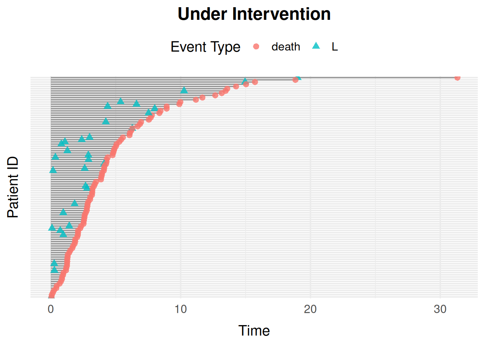

# Migrating to sim_events()

``` r

library(simevent)
library(survival)

compare_model <- function(wrapper_data, model_data) {
  wrapper_data <- as.data.frame(wrapper_data)
  model_data <- as.data.frame(model_data)
  # The wrappers code events as integers; the models below declare their
  # processes in the same order as those codes.
  model_data$Delta <- as.integer(model_data$event) - 1L
  names(model_data)[match(c("id", "time"), names(model_data))] <-
    c("ID", "Time")
  isTRUE(all.equal(
    wrapper_data,
    model_data[names(wrapper_data)],
    tolerance = 1e-6
  ))
}
```

`compare_model()` checks that a
[`sim_events()`](https://github.com/BjarkeHautop/simevent/reference/sim_events.md)
reproduction draws the same random numbers, in the same order, as the
wrapper it reproduces. Only holds below for
[`simSurvData()`](https://github.com/BjarkeHautop/simevent/reference/simSurvData.md)/[`simCRdata()`](https://github.com/BjarkeHautop/simevent/reference/simCRdata.md).

[`simDisease()`](https://github.com/BjarkeHautop/simevent/reference/simDisease.md)/[`simTreatment()`](https://github.com/BjarkeHautop/simevent/reference/simTreatment.md)
have a `"transient"` process, so individuals finish at different times:
[`sim_events()`](https://github.com/BjarkeHautop/simevent/reference/sim_events.md)
only draws for whoever’s still running, while the wrapper draws for
everyone and discards the unused draws for those already finished.

## Introduction

Introduces the
[`sim_events()`](https://github.com/BjarkeHautop/simevent/reference/sim_events.md)
API, a front end to the same simulator as
[`sim.generic()`](https://github.com/BjarkeHautop/simevent/reference/sim.generic.md).

## The `sim_model()` Interface

A
[`sim_model()`](https://github.com/BjarkeHautop/simevent/reference/sim_model.md)
call has three kinds of possible inputs:

- [`sim_covariate()`](https://github.com/BjarkeHautop/simevent/reference/sim_covariate.md):
  a baseline covariate generator. Takes `N` and, optionally, any other
  covariate defined earlier in the same call (matched by argument name).
- [`sim_process()`](https://github.com/BjarkeHautop/simevent/reference/sim_process.md):
  a `"censoring"`, `"terminal"`, or `"transient"` (fires at most `limit`
  times, default `Inf`) process, with Weibull `eta`/`nu` parameters or a
  given cumulative baseline hazard curve (`cumhaz`).
- [`sim_effect()`](https://github.com/BjarkeHautop/simevent/reference/sim_effect.md):
  a `from -> to` edge with a Cox-type `coef`, where `from` is a
  covariate or process name and `to` is a process name.

``` r

model <- sim_model(
  L0 = sim_covariate(function(N) rbinom(N, 1, 0.4)),
  censoring = sim_process("censoring", eta = 0.1, nu = 1.1),
  death = sim_process("terminal", eta = 0.1, nu = 1.1),
  effects = list(sim_effect("L0", "death", coef = 1.5))
)
model
#> <sim_model>
#>   1 covariate(s): L0
#>   2 process(es): censoring, death
#>   1 effect(s)

data <- sim_events(model, n = 100)
head(data)
#> Key: <id>
#>       id      time     event    L0
#>    <int>     <num>    <fctr> <int>
#> 1:     1 9.4336965 censoring     0
#> 2:     2 0.6976071     death     1
#> 3:     3 1.4599321     death     1
#> 4:     4 1.1054092 censoring     0
#> 5:     5 0.7424153 censoring     1
#> 6:     6 0.5835735     death     1
```

[`sim_events()`](https://github.com/BjarkeHautop/simevent/reference/sim_events.md)’s
`intervene` argument replaces
[`sim.generic()`](https://github.com/BjarkeHautop/simevent/reference/sim.generic.md)’s
`alpha.intervention`/`baseline.intervention` pair with a single named
list: give a process name to scale its `eta`, or a covariate name to fix
it to a constant.

``` r

data_intervened <- sim_events(
  model,
  n = 100,
  intervene = list(death = 0.2, L0 = 1)
)
head(data_intervened)
#> Key: <id>
#>       id       time     event    L0
#>    <int>      <num>    <fctr> <num>
#> 1:     1  1.9701625 censoring     1
#> 2:     2  1.9174987 censoring     1
#> 3:     3  2.1555570     death     1
#> 4:     4  0.3174053     death     1
#> 5:     5  1.9387826 censoring     1
#> 6:     6 11.3660695     death     1
```

### Non-Linear and History-Dependent Effects

[`sim_effect()`](https://github.com/BjarkeHautop/simevent/reference/sim_effect.md)’s
`from` doesn’t have to name a single covariate or process. Any other
string is parsed and evaluated as an R expression, against every
covariate/process value plus the current time `t`, the event times
`T_<proc>.<k>` (time of `proc`’s `k`-th event, `0` if it hasn’t happened
yet) and `last_time(proc)`. Covers thresholds, interactions, and
nonlinear transforms inline, and effects depending on a process’s full
occurrence history, not just its current count, without a separate
[`sim_derived()`](https://github.com/BjarkeHautop/simevent/reference/sim_derived.md)
covariate.

For example, an effect that only fires on a process’s 3rd occurrence,
not the 1st or 2nd:

``` r

relapse_model <- sim_model(
  censoring = sim_process("censoring", eta = 0.01, nu = 1),
  relapse = sim_process("transient", eta = 0.3, nu = 1, limit = 5),
  death = sim_process("terminal", eta = 0.01, nu = 1),
  effects = list(
    sim_effect("relapse == 3", "death", coef = 8)
  )
)

set.seed(1405)
relapse_data <- sim_events(relapse_model, n = 2000, max_events = 40)

deaths <- relapse_data[relapse_data$event == "death", ]
mean(deaths$relapse == 3)
#> [1] 0.893956
```

Most deaths happen right at the 3rd relapse, not before or after.

`T_<proc>.<k>` and `last_time()` give access to timing, not just counts.
`T_<proc>.<k>` is the time of `proc`’s `k`-th event, and `0` if it
hasn’t happened yet. Effects on time since an event therefore take the
form `proc * f(t - T_proc.k)`: multiplying by the event count switches
the effect off until the event has happened, whatever `f` is.

Here the death hazard spikes right after an operation and then fades:

``` r

operation_model <- sim_model(
  censoring = sim_process("censoring", eta = 0.05, nu = 1),
  operation = sim_process("transient", eta = 0.2, nu = 1, limit = 1),
  death = sim_process("terminal", eta = 0.02, nu = 1),
  effects = list(
    sim_effect("operation * exp(-(t - T_operation.1))", "death", coef = 3)
  )
)

operation_data <- sim_events(operation_model, n = 2000)
head(operation_data)
#> Key: <id>
#>       id       time     event operation
#>    <int>      <num>    <fctr>     <num>
#> 1:     1  4.8162058 operation         1
#> 2:     1 19.2543737     death         1
#> 3:     2  2.0629123 operation         1
#> 4:     2  2.4574322     death         1
#> 5:     3  0.5061987 operation         1
#> 6:     3 20.3693092 censoring         1
```

Without the `operation *`, the not-yet-operated would have
`exp(-(t - 0)) = exp(-t)`, a spike at time 0 that never happened. For a
risk that instead builds up after the operation, use
`operation * (t - T_operation.1)`.

And here the death hazard drops for one time unit right after each
checkup:

``` r

checkup_model <- sim_model(
  censoring = sim_process("censoring", eta = 0.05, nu = 1.1),
  checkup = sim_process("transient", eta = 0.3, nu = 1),
  death = sim_process("terminal", eta = 0.05, nu = 1.1),
  effects = list(
    sim_effect("t - last_time(checkup) < 1", "death", coef = -2)
  )
)

checkup_data <- sim_events(checkup_model, n = 2000)
head(checkup_data)
#> Key: <id>
#>       id       time     event checkup
#>    <int>      <num>    <fctr>   <num>
#> 1:     1  3.6908384   checkup       1
#> 2:     1 13.3649425   checkup       2
#> 3:     1 13.5615104 censoring       2
#> 4:     2  0.9333917   checkup       1
#> 5:     2  7.2505068   checkup       2
#> 6:     2 14.4228692   checkup       3
```

`last_time(proc)` is `-Inf` before `proc`’s first occurrence, so
`t - last_time(proc) < 1` needs no `NA` handling.

## Reproducing the Preset Wrappers

### `simSurvData()`

[`simSurvData()`](https://github.com/BjarkeHautop/simevent/reference/simSurvData.md)’s
default (`beta = NULL`, i.e. no covariate effects) is two terminal
processes, censoring and death, both with `eta = 0.1`, `nu = 1.1`:

``` r

set.seed(1405)
wrapper_data <- simSurvData(200)
#> Warning: `simSurvData()` was deprecated in simevent 0.2.0.
#> ℹ Please use `sim_events()` instead.

set.seed(1405)
model <- sim_model(
  L0 = sim_covariate(function(N) runif(N)),
  A0 = sim_covariate(function(N, L0) rbinom(N, 1, 0.5)),
  censoring = sim_process("censoring", eta = 0.1, nu = 1.1),
  death = sim_process("terminal", eta = 0.1, nu = 1.1)
)
model_data <- sim_events(model, n = 200)

compare_model(wrapper_data, model_data)
#> [1] TRUE
```

### `simCRdata()`

[`simCRdata()`](https://github.com/BjarkeHautop/simevent/reference/simCRdata.md)
adds a third terminal process (a second competing cause):

``` r

set.seed(1405)
beta <- matrix(c(0.5, -1, -0.5, 0.5, 0, 0.5), ncol = 3, nrow = 2)
wrapper_data <- simCRdata(N = 200, beta = beta)
#> Warning: `simCRdata()` was deprecated in simevent 0.2.0.
#> ℹ Please use `sim_events()` instead.

set.seed(1405)
model <- sim_model(
  L0 = sim_covariate(function(N) runif(N)),
  A0 = sim_covariate(function(N, L0) rbinom(N, 1, 0.5)),
  censoring = sim_process("censoring", eta = 0.1, nu = 1.1),
  cause1 = sim_process("terminal", eta = 0.1, nu = 1.1),
  cause2 = sim_process("terminal", eta = 0.1, nu = 1.1),
  effects = list(
    sim_effect("L0", "censoring", 0.5),
    sim_effect("A0", "censoring", -1),
    sim_effect("L0", "cause1", -0.5),
    sim_effect("A0", "cause1", 0.5),
    sim_effect("A0", "cause2", 0.5)
  )
)
model_data <- sim_events(model, n = 200)

compare_model(wrapper_data, model_data)
#> [1] TRUE
```

### `simDisease()`

[`simDisease()`](https://github.com/BjarkeHautop/simevent/reference/simDisease.md)
has a censoring process, a terminal death process, and a covariate
process `L` that can happen at most once and can itself affect death; a
`"transient"` process with `limit = 1`. Since `L` can fire, the
simulation loop can run more than once per individual, so
[`sim_events()`](https://github.com/BjarkeHautop/simevent/reference/sim_events.md)’s
random draws no longer line up one-to-one with
[`simDisease()`](https://github.com/BjarkeHautop/simevent/reference/simDisease.md)’s
(see the note on `compare_model()` above); event-type proportions are
compared instead:

``` r

set.seed(1405)
wrapper_data <- simDisease(
  N = 5000,
  cens = 1,
  eta = c(0.1, 0.3, 0.1),
  nu = c(1.1, 1.3, 1.1),
  beta_L0_L = 1,
  beta_A0_L = -1.1,
  beta_L_D = 1,
  beta_L0_D = 0
)
#> Warning: `simDisease()` was deprecated in simevent 0.2.0.
#> ℹ Please use `sim_events()` instead.

model <- sim_model(
  L0 = sim_covariate(function(N) runif(N)),
  A0 = sim_covariate(function(N, L0) rbinom(N, 1, 0.5)),
  censoring = sim_process("censoring", eta = 0.1, nu = 1.1),
  death = sim_process("terminal", eta = 0.3, nu = 1.3),
  L = sim_process("transient", eta = 0.1, nu = 1.1, limit = 1),
  effects = list(
    sim_effect("L0", "L", 1),
    sim_effect("A0", "L", -1.1),
    sim_effect("L", "death", 1)
  )
)
model_data <- sim_events(model, n = 5000)

rbind(
  simDisease = prop.table(table(wrapper_data$Delta)),
  sim_model = prop.table(table(model_data$event))
)
#>                    0         1         2
#> simDisease 0.1687941 0.6709775 0.1602284
#> sim_model  0.1593545 0.6811229 0.1595226
```

### `simTreatment()`

[`simTreatment()`](https://github.com/BjarkeHautop/simevent/reference/simTreatment.md)
(with `op = 1`, the default) adds a second `"transient"` process,
treatment (`A`), which can itself affect and be affected by the
covariate process `L`.
[`simTreatment()`](https://github.com/BjarkeHautop/simevent/reference/simTreatment.md)
doesn’t declare its own `A0`, so its reproduction skips it too:
[`sim_model()`](https://github.com/BjarkeHautop/simevent/reference/sim_model.md)
has no default covariates.

``` r

set.seed(1405)
wrapper_data <- simTreatment(
  N = 5000,
  beta_L_A = 1,
  beta_L_D = 1,
  beta_A_D = -1,
  beta_A_L = -0.5,
  beta_L0_A = 1,
  eta = rep(0.1, 4),
  nu = rep(1.1, 4),
  cens = 1,
  op = 1
)
#> Warning: `simTreatment()` was deprecated in simevent 0.2.0.
#> ℹ Please use `sim_events()` instead.

model <- sim_model(
  L0 = sim_covariate(function(N) runif(N)),
  censoring = sim_process("censoring", eta = 0.1, nu = 1.1),
  death = sim_process("terminal", eta = 0.1, nu = 1.1),
  A = sim_process("transient", eta = 0.1, nu = 1.1, limit = 1),
  L = sim_process("transient", eta = 0.1, nu = 1.1, limit = 1),
  effects = list(
    sim_effect("L0", "death", 1),
    sim_effect("L0", "A", 1),
    sim_effect("L0", "L", 1),
    sim_effect("A", "death", -1),
    sim_effect("A", "L", -0.5),
    sim_effect("L", "death", 1),
    sim_effect("L", "A", 1)
  )
)
model_data <- sim_events(model, n = 5000)

rbind(
  simTreatment = prop.table(table(wrapper_data$Delta)),
  sim_model = prop.table(table(model_data$event))
)
#>                      0         1         2         3
#> simTreatment 0.2233639 0.3350458 0.2285012 0.2130891
#> sim_model    0.2180713 0.3445482 0.2259480 0.2114324
```

### `simStatinData()`

[`simStatinData()`](https://github.com/BjarkeHautop/simevent/reference/simStatinData.md)
mainly demonstrates non-default baseline covariate generators.
[`sim_covariate()`](https://github.com/BjarkeHautop/simevent/reference/sim_covariate.md)
reproduces this directly, with no forced covariate names to work around:

``` r

set.seed(1405)
model <- sim_model(
  L0 = sim_covariate(function(N) rbinom(N, 1, 0.4)),
  A0 = sim_covariate(function(N, L0) pmin(rexp(N, 0.3) + 70, 100)),
  censoring = sim_process("censoring", eta = 0.025, nu = 1.1),
  death = sim_process("terminal", eta = 0.025, nu = 1.1)
)
model_data <- sim_events(model, n = 200)
summary(model_data$A0)
#>    Min. 1st Qu.  Median    Mean 3rd Qu.    Max. 
#>   70.00   70.82   71.96   73.14   74.18   85.01
```

## Estimating Intervention Effects

[`alphaSim()`](https://github.com/BjarkeHautop/simevent/reference/alphaSim.md)
and
[`intEffectAlpha()`](https://github.com/BjarkeHautop/simevent/reference/intEffectAlpha.md)
simulate one of the preset settings with the shape parameter `eta` of
one process multiplied by `alpha`, and summarise the result as the
proportion of individuals experiencing death and the intervened process
by time \tau (or the years lost to them before \tau). With the model API
this splits into two general steps, which work for any process in any
model:

1.  Simulate under the intervention with
    [`sim_events()`](https://github.com/BjarkeHautop/simevent/reference/sim_events.md)’s
    `intervene` argument: `intervene = list(<process> = alpha)`
    multiplies that process’s `eta` by `alpha`.
2.  Summarise with
    [`event_risk()`](https://github.com/BjarkeHautop/simevent/reference/event_risk.md):
    the risk P(T \le \tau) of each process’s first event, or
    (`type = "time_lost"`) the expected time lost to it before \tau,
    E\[\tau - \min(T, \tau)\].

Take
[`alphaSim()`](https://github.com/BjarkeHautop/simevent/reference/alphaSim.md)’s
`"Disease"` setting with `alpha = 0.5`, which halves the hazard of the
disease process `L`:

``` r

set.seed(1405)
alphaSim(
  N = 5000,
  eta = rep(0.1, 3),
  nu = rep(1.1, 3),
  alpha = 0.5,
  tau = 5,
  setting = "Disease"
)
#> Warning: `alphaSim()` was deprecated in simevent 0.2.0.
#> ℹ Please use `sim_events()` instead.
#> $effectDeath
#> [1] 0.6977671
#> 
#> $effectSetting
#> [1] 0.2531898
```

The same model with
[`sim_model()`](https://github.com/BjarkeHautop/simevent/reference/sim_model.md):

``` r

disease_model <- sim_model(
  L0 = sim_covariate(function(N) runif(N)),
  A0 = sim_covariate(function(N, L0) rbinom(N, 1, 0.5)),
  censoring = sim_process("censoring", eta = 0.1, nu = 1.1),
  death = sim_process("terminal", eta = 0.1, nu = 1.1),
  L = sim_process("transient", eta = 0.1, nu = 1.1, limit = 1),
  effects = list(
    sim_effect("L0", "death", 1),
    sim_effect("L0", "L", 1),
    sim_effect("L", "death", 1)
  )
)
```

[`alphaSim()`](https://github.com/BjarkeHautop/simevent/reference/alphaSim.md)
switches censoring off by default (`cens = 0`). Simulating both with and
without the intervention gives the effect directly:

``` r

set.seed(1405)
observed <- sim_events(disease_model, n = 5000, cens = 0)
intervened <- sim_events(
  disease_model,
  n = 5000,
  cens = 0,
  intervene = list(L = 0.5)
)

risk_observed <- event_risk(observed, disease_model, c("death", "L"), tau = 5)
risk_intervened <- event_risk(
  intervened,
  disease_model,
  c("death", "L"),
  tau = 5
)
cbind(
  risk_observed[, "process"],
  observed = risk_observed$risk,
  intervened = risk_intervened$risk
)
#>    process observed intervened
#>     <char>    <num>      <num>
#> 1:   death   0.7536     0.7048
#> 2:       L   0.4240     0.2522
```

Halving the disease hazard lowers the risk of disease, and, since
disease raises the death hazard (`sim_effect("L", "death", 1)`), the
risk of death too.

[`alphaSim()`](https://github.com/BjarkeHautop/simevent/reference/alphaSim.md)/[`intEffectAlpha()`](https://github.com/BjarkeHautop/simevent/reference/intEffectAlpha.md)’s
`years_lost = TRUE` corresponds to `type = "time_lost"`, and their `a0`
argument (summarise only individuals with `A0 == a0`) to `by = "A0"`,
which summarises every group at once:

``` r

event_risk(
  intervened,
  disease_model,
  c("death", "L"),
  tau = 5,
  type = "time_lost",
  by = "A0"
)
#>       A0 process time_lost
#>    <int>  <char>     <num>
#> 1:     0   death 1.9576333
#> 2:     1   death 1.9396741
#> 3:     0       L 0.7580466
#> 4:     1       L 0.7724950
```

`by` conditions on the observed value of `A0`. For a `do()`-style
contrast, where everyone’s `A0` is set to a value, fix it with
`intervene` instead, e.g. `intervene = list(L = 0.5, A0 = 1)`.

Finally,
[`intEffectAlpha()`](https://github.com/BjarkeHautop/simevent/reference/intEffectAlpha.md)’s
`plot = TRUE` is
[`plot_event_data()`](https://github.com/BjarkeHautop/simevent/reference/plot_event_data.md)
on the intervened data:

``` r

plot_event_data(
  intervened[intervened$id <= 100, ],
  title = "Under Intervention"
)
```



### Calibrating a Coefficient to a Target Effect

Hitting a specific target effect by hand means repeating the comparison
above many times: a 1-D search. Risk is monotonic in a Cox-type
coefficient, so [`uniroot()`](https://rdrr.io/r/stats/uniroot.html)
finds it directly from a function returning the simulated effect for a
given coefficient.

Use the same `n`/`tau` on every call, and the same random seed for the
natural and intervened runs (common random numbers), so only the
coefficient and the intervention vary, not independent Monte Carlo noise
too. Otherwise the search target is too noisy for
[`uniroot()`](https://rdrr.io/r/stats/uniroot.html) to bracket a root.

Take `disease_model` from above, but suppose disease’s effect on death
(fixed at `1` there) is unknown, and the target is: halving the disease
hazard should lower 5-year death risk by 5 percentage points.

``` r

disease_effect_on_death <- function(coef, n = 3000, tau = 5, seed = 1) {
  model <- sim_model(
    L0 = sim_covariate(function(N) runif(N)),
    A0 = sim_covariate(function(N, L0) rbinom(N, 1, 0.5)),
    censoring = sim_process("censoring", eta = 0.1, nu = 1.1),
    death = sim_process("terminal", eta = 0.1, nu = 1.1),
    L = sim_process("transient", eta = 0.1, nu = 1.1, limit = 1),
    effects = list(
      sim_effect("L0", "death", 1),
      sim_effect("L0", "L", 1),
      sim_effect("L", "death", coef)
    )
  )

  set.seed(seed)
  natural <- sim_events(model, n = n, cens = 0)
  set.seed(seed)
  intervened <- sim_events(
    model,
    n = n,
    cens = 0,
    intervene = list(L = 0.5)
  )

  risk_natural <- event_risk(natural, model, "death", tau = tau)$risk
  risk_intervened <- event_risk(intervened, model, "death", tau = tau)$risk
  risk_natural - risk_intervened
}
```

Larger coefficients make disease matter more for death, so halving its
hazard lowers death risk by more: `disease_effect_on_death()` is
increasing in `coef`.

``` r

sapply(c(0, 1, 2, 3), disease_effect_on_death)
#> [1] -0.003666667  0.046666667  0.077333333  0.086000000
```

[`uniroot()`](https://rdrr.io/r/stats/uniroot.html) finds the
coefficient giving a 5 percentage point reduction:

``` r

calibrated <- uniroot(
  function(coef) disease_effect_on_death(coef) - 0.05,
  interval = c(0, 3),
  tol = 0.01
)
calibrated$root
#> [1] 1.085581
```

For several coefficients and targets at once, wrap the sum of squared
deviations into one objective (still with common random numbers) and use
[`optim()`](https://rdrr.io/r/stats/optim.html) instead of
[`uniroot()`](https://rdrr.io/r/stats/uniroot.html).

## Building a `sim_model()` from Fitted Cox Models

[`sim_model_from_fits()`](https://github.com/BjarkeHautop/simevent/reference/sim_model_from_fits.md)
is the model-native replacement for
[`sim.from.data()`](https://github.com/BjarkeHautop/simevent/reference/sim.from.data.md):
instead of user-specified effects, it builds a
[`sim_model()`](https://github.com/BjarkeHautop/simevent/reference/sim_model.md)
from a set of fitted
[`coxph()`](https://rdrr.io/pkg/survival/man/coxph.html) models (one per
process) and the data they were fit to, so simulated data mimics an
observed dataset’s distribution.

Unlike
[`sim.from.data()`](https://github.com/BjarkeHautop/simevent/reference/sim.from.data.md),
which requires building a `sim.parameters` list, including a
`baseline.summary` computed by hand from
[`mean()`](https://rdrr.io/r/base/mean.html)/
[`sd()`](https://rdrr.io/r/stats/sd.html)/[`min()`](https://rdrr.io/r/base/Extremes.html)/[`max()`](https://rdrr.io/r/base/Extremes.html),
[`sim_model_from_fits()`](https://github.com/BjarkeHautop/simevent/reference/sim_model_from_fits.md)
resamples whole rows of baseline covariates from the data itself,
keeping each covariate’s distribution and the relationships between
them.

``` r

# Some "observed" data, from a 3-cause competing-risks sim_model():
set.seed(1405)
observed_model <- sim_model(
  L0 = sim_covariate(function(N) runif(N)),
  A0 = sim_covariate(function(N, L0) rbinom(N, 1, 0.5)),
  censoring = sim_process("censoring", eta = 0.1, nu = 1.1),
  cause1 = sim_process("terminal", eta = 0.1, nu = 1.1),
  cause2 = sim_process("terminal", eta = 0.1, nu = 1.1),
  effects = list(
    sim_effect("L0", "censoring", 0.5),
    sim_effect("A0", "censoring", -1),
    sim_effect("L0", "cause1", -0.5),
    sim_effect("A0", "cause1", 0.5),
    sim_effect("A0", "cause2", 0.5)
  )
)
observed_data <- sim_events(observed_model, n = 1000)

# Refit from "observed" data, then rebuild a sim_model(), as if
# observed_model were unknown:
fits <- list(
  censoring = coxph(
    Surv(time, event == "censoring") ~ L0 + A0,
    data = observed_data
  ),
  cause1 = coxph(Surv(time, event == "cause1") ~ L0 + A0, data = observed_data),
  cause2 = coxph(Surv(time, event == "cause2") ~ L0 + A0, data = observed_data)
)
types <- c(censoring = "censoring", cause1 = "terminal", cause2 = "terminal")

model <- sim_model_from_fits(fits, observed_data, types)
model
#> <sim_model>
#>   2 covariate(s): L0, A0
#>   3 process(es): censoring, cause1, cause2
#>   6 effect(s)
```

Each process uses its
[`coxph()`](https://rdrr.io/pkg/survival/man/coxph.html) fit’s
cumulative baseline hazard as-is, so the simulated event times follow
its shape. The hazard is unknown beyond the last observed time, so
simulated follow-up ends there (`event = "max_cens"`).

``` r

new_data <- sim_events(model, n = 1000)
head(new_data)
#> Key: <id>
#>       id     time     event        L0    A0
#>    <int>    <num>    <fctr>     <num> <num>
#> 1:     1 1.620870 censoring 0.9559121     0
#> 2:     2 2.219986    cause2 0.9885974     1
#> 3:     3 2.006563    cause2 0.4766994     1
#> 4:     4 1.701406    cause1 0.1054270     0
#> 5:     5 1.036467    cause2 0.5620987     1
#> 6:     6 4.455880    cause2 0.1166055     1

# Event-type distribution should match between observed and simulated data (a
# few simulated individuals reach the end of the observed follow-up, as
# "max_cens"):
event_levels <- levels(new_data$event)
rbind(
  observed = prop.table(table(factor(observed_data$event, event_levels))),
  simulated = prop.table(table(new_data$event))
)
#>           censoring cause1 cause2 max_cens
#> observed      0.294  0.316  0.390        0
#> simulated     0.318  0.311  0.371        0
```

### Categorical Baseline Covariates

A categorical baseline covariate must be a factor column in `data`,
referenced directly in the
[`coxph()`](https://rdrr.io/pkg/survival/man/coxph.html) formula (not
wrapped in [`factor()`](https://rdrr.io/r/base/factor.html) there).
[`sim_model_from_fits()`](https://github.com/BjarkeHautop/simevent/reference/sim_model_from_fits.md)
regenerates it as its integer level codes, plus one
[`sim_derived()`](https://github.com/BjarkeHautop/simevent/reference/sim_derived.md)
dummy per non-reference level, named to match
[`coxph()`](https://rdrr.io/pkg/survival/man/coxph.html)’s own
coefficient names (`"<variable><level>"`). The model-native replacement
for
[`sim.from.data()`](https://github.com/BjarkeHautop/simevent/reference/sim.from.data.md)’s
`"(region==2)"`-style expression matching.

``` r

observed_data$region <- factor(sample(
  c("a", "b", "c"),
  nrow(observed_data),
  replace = TRUE,
  prob = c(0.5, 0.3, 0.2)
))

fits_region <- list(
  censoring = coxph(
    Surv(time, event == "censoring") ~ L0 + region,
    data = observed_data
  ),
  cause1 = coxph(
    Surv(time, event == "cause1") ~ L0 + region,
    data = observed_data
  ),
  cause2 = coxph(Surv(time, event == "cause2") ~ L0, data = observed_data)
)

model_region <- sim_model_from_fits(fits_region, observed_data, types)
model_region
#> <sim_model>
#>   4 covariate(s): L0, region, regionb, regionc
#>   3 process(es): censoring, cause1, cause2
#>   7 effect(s)
```
