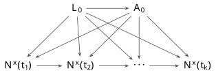
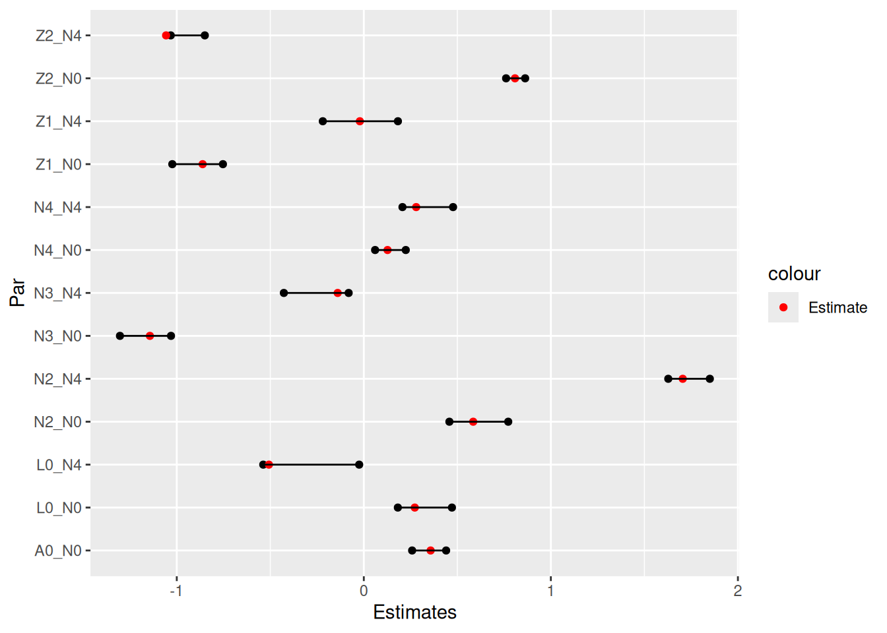
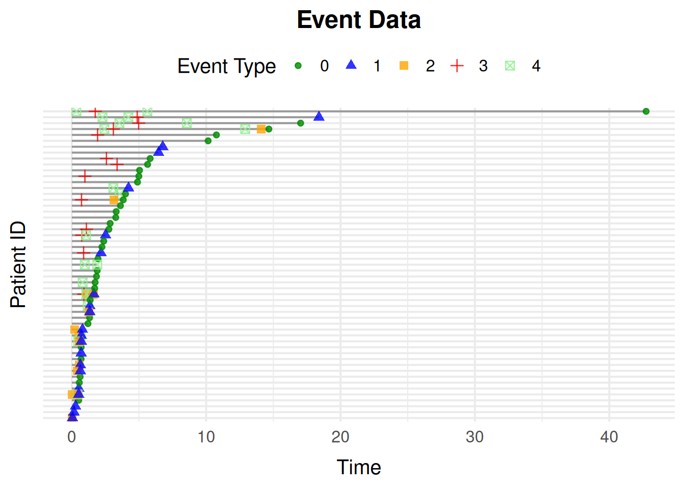
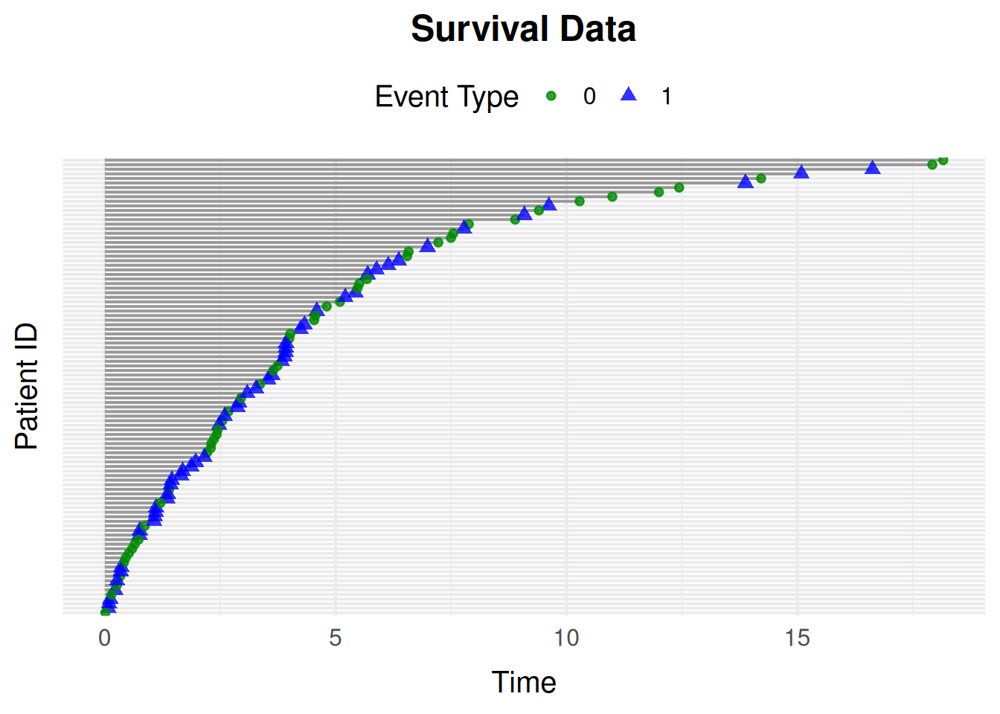
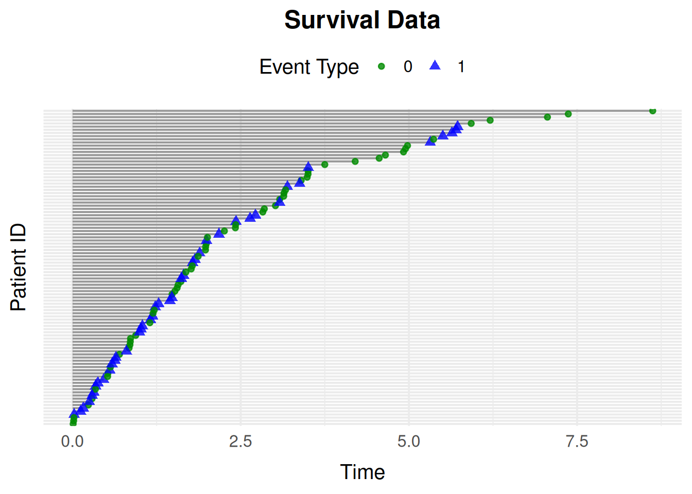
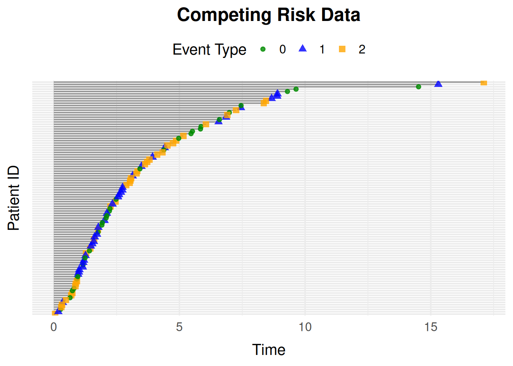
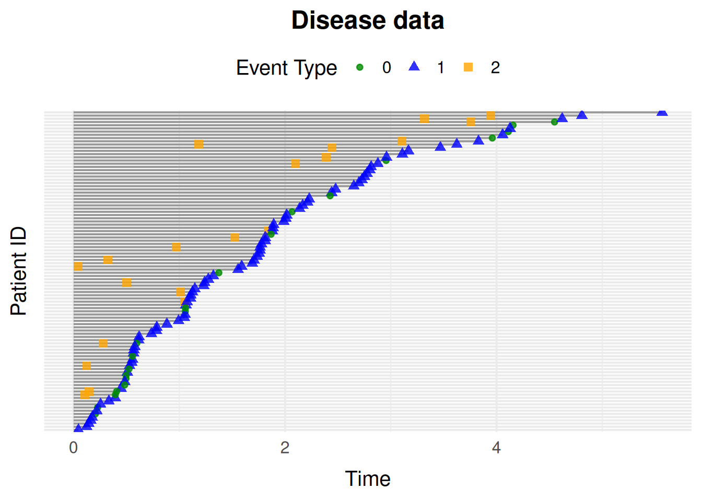
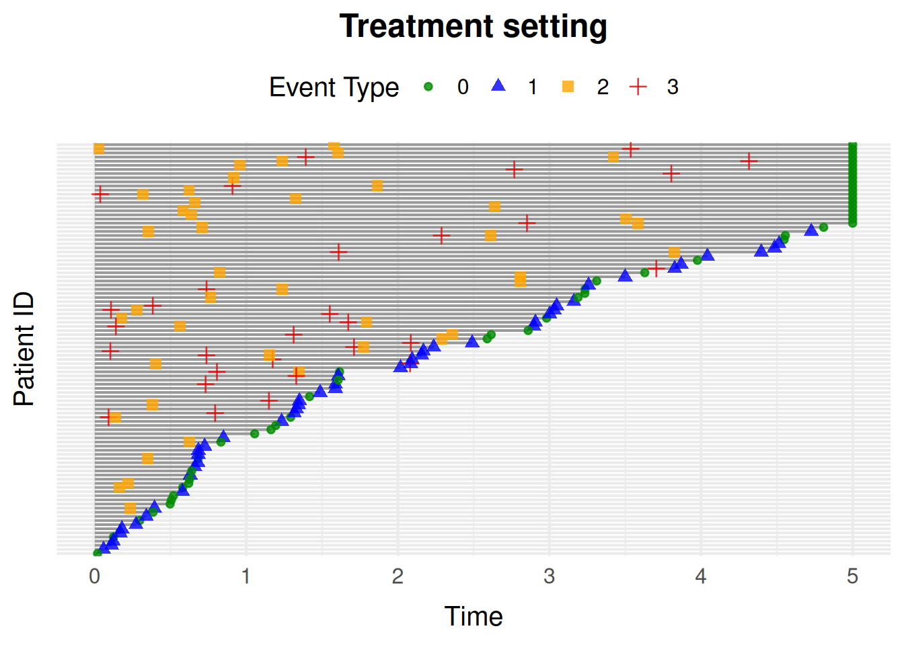
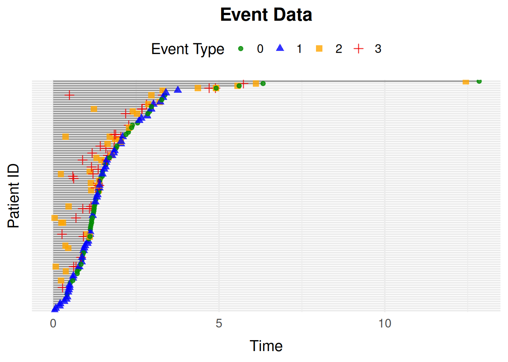
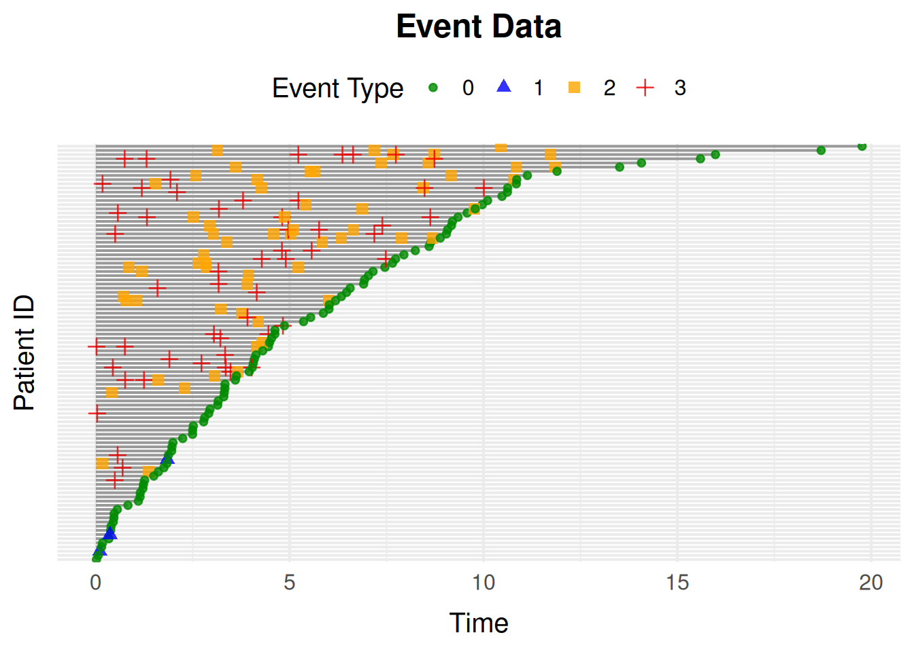

# Getting Started with simevent

``` r

library(simevent)
```

## Introduction

At the core of the package is the general-purpose function
[`simEventData()`](https://github.com/miclukacova/simevent/reference/simEventData.md).
Built on top of it are wrapper functions for common settings (survival
data, competing risks, disease progression), functions for simulating
new data from models fitted to observed data, and functions for
performing and evaluating interventions.

The next section explains the general simulation setting and procedure
from a mathematical point of view. The remaining sections walk through
the package’s functions and how to use them.

## The General Simulation Setting

The simulation approach is similar to [Eimermacher et al.,
2015](https://doi.org/10.1186/s12874-015-0005-2), and is based on a
counting process framework.

### The Mathematics

We consider a scenario where n individuals are followed over a time
interval \mathcal{T} = \[0, \rho), where \rho \in (0,\infty\]. Each
individual can experience J \geq 1 types of events, indexed by
\mathcal{X} = \lbrace 0, 1, \ldots , J \rbrace, with x = 0 denoting
censoring. Event types need not be mutually exclusive, and one event
type is allowed to affect the risk of another. For instance, in
[`simDisease()`](https://github.com/miclukacova/simevent/reference/simDisease.md),
developing the disease changes the hazard of death. For each event type
x \in \mathcal{X}, let N^x denote the associated counting process, so
that N^x(t) counts how many times event x has occurred by time t; we
collect these into the J + 1 dimensional vector N. Because the risk of
an event can depend on the full event history so far, we track the
filtration (\mathcal{F}\_t)\_{t \in \mathcal{T}}, the information
available up to and including time t, and \mathcal{F}\_{t-}, the
information available strictly before t.

We assume the intensity of each counting process takes the form
\lambda^x(t\\ \vert \\ \mathcal{F}\_{t-}) = R^x(t\\ \vert \\
\mathcal{F}\_{t-}) \\ \eta^x \nu^x t^{\nu^x-1} \\ \phi^x(t \\ \vert \\
\mathcal{F}\_{t-}), which combines three components: a Weibull baseline
hazard \eta^x \nu^x t^{\nu^x-1} with scale \eta^x \> 0 and shape \nu^x
\> 0 (intensity increasing over time if \nu^x \> 1, decreasing if \nu^x
\< 1); an at-risk indicator R^x(t \\ \vert \\ \mathcal{F}\_{t-}) \in
\\0, 1\\ that switches event x off once an individual is no longer
eligible for it (e.g. after a terminal event, or once a recurrent event
has reached its maximum count); and a multiplicative term \phi^x(t \\
\vert \\ \mathcal{F}\_{t-}) that captures the effects of baseline
covariates and past events.

We specify these effects through a log-linear model \phi^x(t \\ \vert \\
\mathcal{F}\_{t-}) = \exp \left( L^{\top}\beta_1 + N(t-)^{\top} \beta_2
\right), where L \in \mathbb{R}^d contains the baseline covariates,
\beta_1 \in \mathbb{R}^d their effects on event x, and \beta_2 \in
\mathbb{R}^{J+1} the effects of the event counts immediately before time
t on event x. Thus, the model allows both baseline characteristics and
the event history to modify the intensity while retaining the
multiplicative structure of the proportional-intensity model. For
example, a prior disease event can increase or decrease the hazard of
death.

Simulation proceeds by repeatedly drawing the waiting time until the
next event, conditional on the individual’s current event history. Given
the intensity above, the cumulative hazard determines the distribution
of this waiting time. simevent samples from that distribution by
inverting the cumulative hazard in closed form when possible, and using
numerical methods otherwise, rather than discretizing time.

### The `simEventData()` Function

[`simEventData()`](https://github.com/miclukacova/simevent/reference/simEventData.md)
is the general-purpose function implementing the simulation scheme
above.

Every simulated dataset includes two built-in baseline variables, `L0`
and `A0`. `L0` is a baseline covariate, and `A0` is a baseline treatment
indicator whose generator can depend on `L0`; their distributions can be
changed via `gen_L0`/`gen_A0`. This setup corresponds to the following
DAG:



Figure 1: Confounding structure of the variables generated by
[`simEventData()`](https://github.com/miclukacova/simevent/reference/simEventData.md).

Note the time-varying feedback in the model: event counts N(t-) (of the
same or other event types) can affect the intensity of future events,
e.g. a prior disease event increasing the hazard of death in
[`simDisease()`](https://github.com/miclukacova/simevent/reference/simDisease.md).

You can add baseline covariates beyond the built-in `L0` and `A0` by
supplying generator functions:

``` r

func1 <- function(N) rbinom(N, 1, 0.2)
func2 <- function(N) rnorm(N)
add_cov <- list("Z1" = func1, "Z2" = func2)
```

The `beta` argument specifies the coefficients of the log-linear
intensity model. It is a matrix with one column per event process and
one row per predictor. Rows correspond first to baseline covariates
(`L0`, `A0`, and any covariates supplied via `add_cov`), followed by the
event counts (`N0`, `N1`, …). Thus, `beta[i, j]` gives the effect of
predictor `i` on the intensity of event process `j`.

For example, with the two built-in covariates, two additional
covariates, and five event processes above, `beta` should have 9 rows
and 5 columns:

``` r

set.seed(1405)
beta <- matrix(rnorm(9 * 5), ncol = 5, nrow = 9)
```

Let’s make the setup a bit more complicated by specifying an `at_risk()`
function, which defines the risk windows for recurrent events, based on
how many times each event has already occurred:

``` r

at_risk <- function(events) {
  return(c(
    1,
    1, # Always at risk for event 0 and 1
    as.numeric(events[3] < 2), # Event 2 can occur twice
    as.numeric(events[4] < 1), # Event 3 can occur once
    as.numeric(events[5] < 2) # Event 4 can occur twice
  ))
}
```

Additionally, we also add an `at_risk_cov()` function, which specifies
the risk windows as a function of the baseline covariates.

``` r

at_risk_cov <- function(covariates) {
  return(c(
    1,
    1, # The covariates do not change the risk of event 0 and 1
    as.numeric(covariates[1] < 0.5), # Only at risk of event 2 if L0 < 0.5
    as.numeric(covariates[2] == 1), # Only at risk of event 3 if A0 = 1
    1 # The covariates do not change the risk of event 4
  ))
}
```

So to be at risk, both indicators from `at_risk()` and `at_risk_cov()`
must be true.

Let’s simulate data for 5000 individuals now:

``` r

set.seed(973)
data <- simEventData(
  N = 5000,
  beta = beta,
  add_cov = add_cov,
  at_risk = at_risk,
  at_risk_cov = at_risk_cov
)
head(data)
#> Key: <ID>
#>       ID      Time Delta        L0    A0    Z1        Z2    N0    N1    N2
#>    <int>     <num> <int>     <num> <num> <num>     <num> <num> <num> <num>
#> 1:     1  2.426639     4 0.0482511     1     0 0.9036369     0     0     0
#> 2:     1  3.094270     3 0.0482511     1     0 0.9036369     0     0     0
#> 3:     1 12.906626     4 0.0482511     1     0 0.9036369     0     0     0
#> 4:     1 14.082609     2 0.0482511     1     0 0.9036369     0     0     1
#> 5:     1 14.666997     0 0.0482511     1     0 0.9036369     1     0     1
#> 6:     2  1.834758     0 0.2186699     0     0 1.0631460     1     0     0
#>       N3    N4
#>    <num> <num>
#> 1:     0     1
#> 2:     1     1
#> 3:     1     2
#> 4:     1     2
#> 5:     1     2
#> 6:     0     0
```

#### Formatting Data for Cox Regression

Transform the data into *tstart-tstop* format with
[`IntFormatData()`](https://github.com/miclukacova/simevent/reference/IntFormatData.md)
(specify which columns hold the counting-process data), then fit Cox
models with the survival package:

``` r

library(survival)
library(data.table)
#> 
#> Attaching package: 'data.table'
#> The following object is masked from 'package:base':
#> 
#>     %notin%
library(ggplot2)

data_int <- IntFormatData(data, N_cols = 8:12)

# Process 0
survfit0 <- coxph(
  Surv(tstart, tstop, Delta == 0) ~ L0 + A0 + Z1 + Z2 + N2 + N3 + N4,
  data = data_int
)

# Process 4
survfit4 <- coxph(
  Surv(tstart, tstop, Delta == 4) ~ L0 + Z1 + Z2 + N2 + N3 + N4,
  data = data_int[(N4 < 2) & (A0 == 1)]
)
```

Visualize the estimated coefficients alongside the true values used to
simulate the data:

``` r

CIs <- cbind(
  "Par" = c(
    paste0(rownames(confint(survfit0)), "_N0"),
    paste0(rownames(confint(survfit4)), "_N4")
  ),
  rbind(confint(survfit0), confint(survfit4))
)

rownames(CIs) <- NULL
colnames(CIs) <- c("Par", "Lower", "Upper")
CIs <- data.table(CIs)
CIs[, True_val := c(beta[-c(5, 6), 1], beta[-c(2, 5, 6), 5])]

CIs$Lower <- as.numeric(CIs$Lower)
CIs$Upper <- as.numeric(CIs$Upper)

ggplot(data = CIs) +
  geom_point(aes(y = Par, x = Lower)) +
  geom_point(aes(y = Par, x = Upper)) +
  geom_point(aes(y = Par, x = True_val, col = "Estimate")) +
  scale_color_manual(values = c("Estimate" = "red")) +
  geom_segment(aes(y = Par, yend = Par, x = Lower, xend = Upper)) +
  xlab("Estimates")
```



#### Visualizing Event Histories

[`plotEventData()`](https://github.com/miclukacova/simevent/reference/plotEventData.md)
plots individual event histories over time, e.g. for the first 100
individuals:

``` r

plotEventData(data[1:100, ])
```



#### Overriding Entries of the Beta Matrix

The `override_beta` argument lets you set specific effects without
rebuilding the whole `beta` matrix. For example, zero out the effect of
`L0` on processes `N0` and `N1`:

``` r

data <- simEventData(
  N = 1000,
  beta = beta,
  add_cov = add_cov,
  at_risk = at_risk,
  override_beta = list("L0" = c("N0" = 0, "N1" = 0))
)
```

You can also specify non-linear effects, e.g. increase the effect of
`N2` on `N1` by 2 once `N2 > 1`:

``` r

data <- simEventData(
  N = 1000,
  beta = beta,
  add_cov = add_cov,
  at_risk = at_risk,
  override_beta = list("N2 > 1" = c("N1" = 2))
)
```

Interaction effects are specified similarly, e.g. an interaction effect
of 1 between `L0` and `N3` on `N1`:

``` r

data <- simEventData(
  N = 3 * 10^4,
  beta = beta,
  add_cov = add_cov,
  at_risk = at_risk,
  override_beta = list("L0 * N3" = c("N1" = 1))
)
```

And effects that depend on time, e.g. an additional effect of 0.4 on
`N2` once `T1 > 1`:

``` r

data <- simEventData(
  N = 10000,
  beta = beta,
  add_cov = add_cov,
  at_risk = at_risk,
  override_beta = list("T1 > 1" = c("N2" = 1))
)
```

## Wrapper Functions for Common Settings

[`simEventData()`](https://github.com/miclukacova/simevent/reference/simEventData.md)
is fully general, but for common settings the package provides
ready-made wrappers built on top of it.
[`sim_graph()`](https://github.com/miclukacova/simevent/reference/sim_graph.md)
is a general-purpose alternative to writing another such wrapper: see
[`vignette("sim-event-graph")`](https://github.com/miclukacova/simevent/articles/sim-event-graph.md)
for how each of the wrappers below can be reproduced as a
[`sim_graph()`](https://github.com/miclukacova/simevent/reference/sim_graph.md)
specification.

### Survival Data with `simSurvData()`

[`simSurvData()`](https://github.com/miclukacova/simevent/reference/simSurvData.md)
simulates survival data for individuals at risk of both censoring (0)
and an event (1). By default there are no covariate effects:

``` r

data <- simSurvData(100)
plotEventData(data, title = "Survival Data")
```



You can specify how the baseline covariates `L0` and `A0` affect the
censoring and event hazards through the `beta` matrix, and set the
Weibull shape (\eta) and scale (\nu) parameters:

``` r

# Effects of L0 and A0 on the censoring hazard (1st column) and death hazard (2nd column)
beta <- cbind("Censoring" = c(0, 0), "Death" = c(1, -1))
eta <- c(0.2, 0.2)
nu <- c(1.05, 1.05)

data <- simSurvData(100, beta = beta, eta = eta, nu = nu)
plotEventData(data, title = "Survival Data")
```



### Competing Risk Data with `simCRdata()`

[`simCRdata()`](https://github.com/miclukacova/simevent/reference/simCRdata.md)
simulates data from a competing risk setting with two competing causes,
using the same kind of parameters as
[`simSurvData()`](https://github.com/miclukacova/simevent/reference/simSurvData.md):

``` r

data <- simCRdata(100)
plotEventData(data, title = "Competing Risk Data")
```



### Health Care Data with `simDisease()`

[`simDisease()`](https://github.com/miclukacova/simevent/reference/simDisease.md)
simulates health care data from a setting where patients can experience
three events: **Censoring** (0), **Death** (1), and **Disease** (2). The
`beta_X_Y` arguments control how X affects Y: a positive value means a
higher value of X increases the intensity of Y, and a negative value
decreases it. See `?simDisease()` for the full list of arguments.

``` r

data <- simDisease(
  N = 100,
  cens = 1,
  eta = c(0.1, 0.3, 0.1),
  nu = c(1.1, 1.3, 1.1),
  beta_L0_L = 1,
  beta_A0_L = -1.1,
  beta_L_D = 1,
  beta_L0_D = 0
)

plotEventData(data, title = "Disease data")
```



### Health Care Data with `simTreatment` and `simDropIn`

[`simTreatment()`](https://github.com/miclukacova/simevent/reference/simTreatment.md)
extends the disease setting with a treatment process: it simulates four
event types representing censoring (0), death (1), treatment (2), and
covariate change (3), again controlled via `beta_X_Y` arguments:

``` r

data <- simTreatment(
  N = 100,
  beta_L_A = 1,
  beta_L_D = 1,
  beta_A_D = -1,
  beta_A_L = -0.5,
  beta_L0_A = 1,
  eta = rep(0.1, 4),
  nu = rep(1.1, 4),
  followup = 5,
  cens = 1,
  op = 1
)

plotEventData(data, title = "Treatment setting")
```



[`simDropIn()`](https://github.com/miclukacova/simevent/reference/simDropIn.md)
is a related wrapper for a setting with 4 or 5 events: censoring, death,
drop-in initiation, covariate change, and optionally treatment. It is
again configured through `beta_X_Y` arguments; see `?simDropIn()` for
details.

### Time-Varying Effects with `simEventTV()`

[`simEventTV()`](https://github.com/miclukacova/simevent/reference/simEventTV.md)
adapts
[`simEventData()`](https://github.com/miclukacova/simevent/reference/simEventData.md)
to allow effects that change at a fixed time point: after time
`t_prime`, the matrix `tv_eff` is added to `beta`. This flexibility
comes at the cost of a slightly slower simulation procedure, so use
[`simEventData()`](https://github.com/miclukacova/simevent/reference/simEventData.md)
instead when effects are constant over time.

``` r

set.seed(6258)
eta <- rep(0.1, 4)
term_deltas <- c(0, 1)
tv_eff <- matrix(0.5, ncol = 4, nrow = 6)
beta <- matrix(nrow = 6, ncol = 4, 0.5)
t_prime <- 1

data <- simEventTV(
  N = 100,
  t_prime = t_prime,
  tv_eff = tv_eff,
  eta = eta,
  term_deltas = term_deltas,
  beta = beta,
  lower = 10^(-15),
  upper = 10^2,
  max_events = 30
)

plotEventData(data)
```



### Intensities Depending on Time Since Last Event with `simEventDataTdPhi()`

Sometimes the intensity of an event should depend not just on covariates
and event counts, but on the time elapsed since the most recent
occurrence of that event. Assume the event-specific intensity has the
form \lambda^x(t \mid \mathcal F_t) = R^x(t \mid \mathcal F_t) \\\eta^x
\nu^x t^{\nu^x-1} \\\phi^x(t \mid \mathcal F_t), where \phi^x(t \mid
\mathcal F_t) = \exp\left( L^\top \beta_1 + (T^\* - t)\beta_2 \right),
and T^\* denotes the most recent event time. Simulation from this
setting is done using
[`simEventDataTdPhi()`](https://github.com/miclukacova/simevent/reference/simEventDataTdPhi.md),
which takes the additional argument `beta2` controlling the exponential
decay/growth in \phi^x:

``` r

beta <- matrix(rnorm(4 * 6, 0, 0.1), ncol = 4)
data <- simEventDataTdPhi(
  N = 100,
  beta2 = c(0.01, 2, 0, 0.1),
  beta = beta,
  upper = 10^20,
  max_iter = 10^3
)
plotEventData(data)
```



## Simulating New Data from a Fitted Model

Besides simulating from user-specified parameters, simevent can simulate
new data from a model already fitted to observed data.
[`simEventCox()`](https://github.com/miclukacova/simevent/reference/simEventCox.md)
does this for Cox proportional hazards models, and
[`simEventObj()`](https://github.com/miclukacova/simevent/reference/simEventObj.md)
for any model equipped with a `predict2` method.

Say we have some observed data:

``` r

set.seed(373)
beta <- matrix(c(0.5, -1, -0.5, 0.5, 0, 0.5), ncol = 3, nrow = 2)
data <- simCRdata(N = 1000, beta = beta)
```

### Using `simEventCox()`

Fit Cox models for the events of interest, then pass the fitted models
to
[`simEventCox()`](https://github.com/miclukacova/simevent/reference/simEventCox.md):

``` r

cox1 <- coxph(Surv(Time, Delta == 1) ~ L0 + A0, data = data)
cox2 <- coxph(Surv(Time, Delta == 2) ~ L0 + A0, data = data)

cox_fits <- list("Process 1" = cox1, "Process 2" = cox2)
old_vars <- data[, c(4, 5)]
new_data <- simEventCox(100, cox_fits, old_vars = old_vars)
head(new_data)
#> Key: <ID>
#>       ID      Time Delta        L0    A0 Process 1 Process 2
#>    <int>     <num> <num>     <num> <num>     <num>     <num>
#> 1:     1 0.4931728     1 0.5363954     0         0         1
#> 2:     1 4.0046486     0 0.5363954     0         1         1
#> 3:     2 0.6828662     1 0.3144497     0         0         1
#> 4:     2 9.8772172     0 0.3144497     0         1         1
#> 5:     3 0.8909987     1 0.9335247     1         0         1
#> 6:     3 4.2916262     0 0.9335247     1         1         1
```

New baseline covariates are simulated by resampling rows of `old_vars`.

### Using `simEventObj()`

[`simEventObj()`](https://github.com/miclukacova/simevent/reference/simEventObj.md)
works with any fitted model, as long as you equip it with a `predict2()`
method returning the times and cumulative hazard for new covariate
values. For example, with a Cox model:

``` r

cox_fit <- coxph(Surv(Time, Delta == 1) ~ L0 + A0, data = data)

predict2 <- function(obj, ...) UseMethod("predict2")
predict2.coxph <- function(obj, sim_data, ...) {
  preds <- survfit(obj, newdata = sim_data)
  # preds$cumhaz is a times x individuals matrix; reshape to individuals x times x events
  chf <- array(t(preds$cumhaz), dim = c(nrow(sim_data), length(preds$time), 1))
  list(time = preds$time, chf = chf)
}

old_vars <- data[, c("L0", "A0")]
new_data <- simEventObj(100, cox_fit, old_vars = old_vars)
head(new_data)
#> Key: <ID>
#>       ID      Time Delta          L0    A0    N0
#>    <int>     <num> <num>       <num> <num> <num>
#> 1:     1       Inf     0 0.926276597     0     0
#> 2:     2       Inf     0 0.730683018     0     0
#> 3:     3 13.181177     1 0.057044588     0     1
#> 4:     4  8.531944     1 0.006538616     1     1
#> 5:     5  1.371236     1 0.921506565     1     1
#> 6:     6  4.866903     1 0.240172203     0     1
```

## Interventions

[`alphaSim()`](https://github.com/miclukacova/simevent/reference/alphaSim.md)
and
[`intEffectAlpha()`](https://github.com/miclukacova/simevent/reference/intEffectAlpha.md)
simulate data under an intervention that multiplies the shape parameter
of a chosen process by a factor `alpha`, in one of the predefined
settings (`"Disease"`, `"Drop In"`, `"Treatment"`, or `"Statin"`).

Say we want to intervene in the Drop In setting by scaling the intensity
of the drop-in process. Data without intervention is obtained by scaling
with the factor 1:

``` r

alphaSim(N = 10^3, alpha = 1, tau = 5, setting = "Drop In")
#> $effectDeath
#> [1] 0.1067194
#> 
#> $effectSetting
#> [1] 0.6679842
```

By default,
[`alphaSim()`](https://github.com/miclukacova/simevent/reference/alphaSim.md)
returns the proportion of individuals who experience death, and the
proportion who experience Drop In, by a specified time \tau, in group
`A0 = a0`. Setting `years_lost = TRUE` instead returns the number of
years lost to death and Drop In before \tau; setting
`return_data = TRUE` returns the simulated data itself.

[`intEffectAlpha()`](https://github.com/miclukacova/simevent/reference/intEffectAlpha.md)
performs the same kind of intervention and additionally plots a sample
of the simulated event data:

``` r

intEffectAlpha(
  N = 1000,
  alpha = 0.7,
  tau = 5,
  years_lost = TRUE,
  a0 = 1,
  plot = TRUE,
  setting = "Drop In"
)
#> $effect_2
#> [1] 1.57399
#> 
#> $effect_death
#> [1] 0.2253148
```
