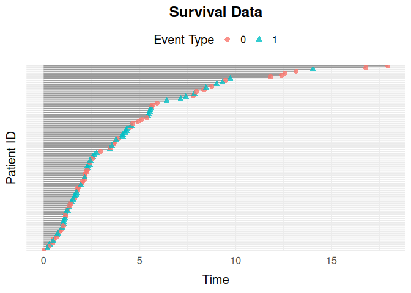

# simevent

The `simevent` package provides tools for simulating and analyzing
complex continuous-time health care data. The simulated data includes
variables that can be interpreted as treatment decisions, disease
progression, and health factors.

## Installation

You can install the stable version of simevent from CRAN with:

``` r

install.packages("simevent")
```

or the development version of simevent from GitHub using pak:

``` r

pak::pak("miclukacova/simevent")
```

## Usage

``` r

library(simevent)
```

The package builds event history data from a *graph*: baseline
covariates, event processes (censoring, terminal, or transient, with
Weibull intensities), and the Cox-type effects between them.
[`sim_graph()`](https://github.com/miclukacova/simevent/reference/sim_graph.md)
defines the graph and
[`sim_event_graph()`](https://github.com/miclukacova/simevent/reference/sim_event_graph.md)
simulates from it. On top of this, the package provides:

- [`sim_graph_from_fits()`](https://github.com/miclukacova/simevent/reference/sim_graph_from_fits.md)
  for building a graph from `coxph()` fits to observed data, to simulate
  new data resembling it.
- [`interval_format_data()`](https://github.com/miclukacova/simevent/reference/interval_format_data.md)
  and
  [`plot_event_data()`](https://github.com/miclukacova/simevent/reference/plot_event_data.md)
  for reformatting and plotting simulated data.
- The `intervene` argument of
  [`sim_event_graph()`](https://github.com/miclukacova/simevent/reference/sim_event_graph.md),
  together with
  [`event_risk()`](https://github.com/miclukacova/simevent/reference/event_risk.md),
  for simulating and evaluating interventions on processes and
  covariates.

A minimal example, simulating survival data for 100 individuals and
plotting the event histories:

``` r

graph <- sim_graph(
  censoring = sim_process("censoring", eta = 0.1, nu = 1.1),
  death = sim_process("terminal", eta = 0.1, nu = 1.1)
)
data <- sim_event_graph(graph, n = 100)
plot_event_data(data, title = "Survival Data")
```



For a full walkthrough of the simulation framework and all of the
functions above, see
[`vignette("sim-event-graph")`](https://github.com/miclukacova/simevent/articles/sim-event-graph.md).

## Contributing

All contributions are welcome!
